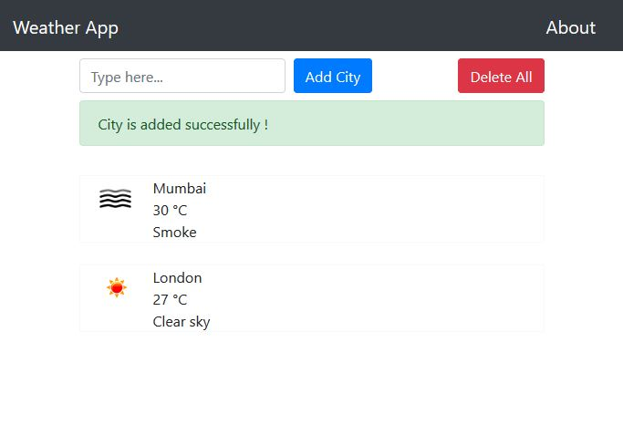

# WeatherApp-Django
WeatherApp is a app which lets you check different city weathers at the same time, this app is built using OpenWeatherAPI, Python, Django Framework, HTML, CSS & Bootstrap.

## To create a new project
> django-admin startproject project_name

## Start the development server
> python manage.py runserver

## Creating the app
> python manage.py startapp app_name

## Creating necessary database tables
> python manage.py migrate

## Telling Django that you’ve made some changes to your models
> python manage.py makemigrations

## Creating an admin user
> python manage.py createsuperuser

### This is how this app will look after cloning this repository
> 

> 

> 

> 

You can delete all cities just by clicking on delete button